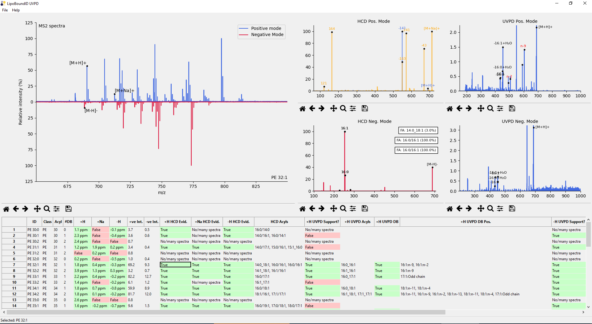

# LipoBoundID‑UVPD

**Deep characterisation of bacterial protein‑lipid complexes by multistage mass spectrometry (MS²/MS³) and 213 nm ultraviolet photodissociation (UVPD).**



LipoBoundID‑UVPD ingests Thermo RAW files, links MS³ HCD/UVPD scans to their parent MS² spectra, and annotates phospholipid headgroups, fatty‑acyl chains, and double‑bond positions. A GUI lets you visualise every spectrum, while a tidy CSV report captures the quantitative results.

## Quick start

```bash
# 1. Create and activate a dedicated environment (Python 3.9)
conda create -n lipobound python=3.9
conda activate lipobound

# 2. Clone the repository
git clone https://github.com/kanalstrahlen/LipoBoundID-UVPD.git
cd LipoBoundID-UVPD

# 3. Install dependencies
pip install -r requirements.txt

# 4. Launch the GUI
python main.py
```
As described in the [pymsfilereader](https://github.com/frallain/pymsfilereader) documentation, you must also download Thermo Fisher MSFileReader if it is not already installed on your system.

> **Tested on Windows 10/11 (x64).**

## Input data layout

- Place **all** `.RAW` files from an experiment in **one folder**.
- Each file must contain **a single scan** only:
  - MS² scans (CID/HCD) in positive *and/or* negative mode.
  - Any MS³ scans (HCD or UVPD) recorded after lipid release.
- Duplicate spectra are ignored (a warning is printed).

```
MlaC_example/
├── 20250101_MlaC_MS2_pos.raw
├── 20250101_MlaC_MS2_neg.raw
├── 20250101_MlaC_MS3_750_HCD_pos.raw
└── 20250101_MlaC_MS3_750_UVPD_neg.raw
```

Open the folder via **File ▸ Select folder**. Analysis usually finishes in < 20 s.

## Output
- An interactive dashboard displaying:
  - The combined MS² spectrum (positive above x‑axis, negative below).
  - Linked MS³ HCD & UVPD spectra for each lipid hit.
- A **CSV table** with:
  - m/z, adduct, ppm error, intensities.
  - Head‑group confirmation flags.
  - Candidate acyl pairs and UVPD double‑bond localisation.

Save results via **File ▸ Export results**.

## Example data

A benchmark data set for MlaC (Orbitrap Eclipse) is available on FigShare: **DOI 10.25446/oxford.29355752**. Download the folder, load it in LipoBoundID‑UVPD, and verify that analysis completes without errors.

## Supported lipid classes

| Class | Adducts     | Diagnostic evidence                            |
| ----- | ----------- | ---------------------------------------------- |
| PE    | +H, +Na, –H | –141 Da neutral loss, acyl anions, UVPD DB/CP fragments |
| PG    | +Na, –H | –194/–172 Da neutral losses, acyl anions, UVPD DB/CP fragments       |

> Expansion to additional bacterial and mammalian lipids is planned.

## Funding and Acknowledgements
This project was supported by a Medical Research Council programme grant (MR/V028839/1), a Wellcome Trust Award (221795/Z/20/Z), and the Leopoldina fellowship program of the German National Academy of Sciences Leopoldina (LPDS 2023-07).
